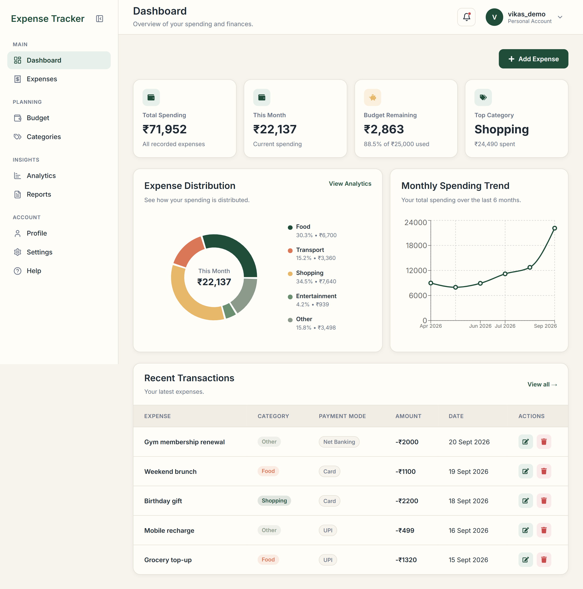
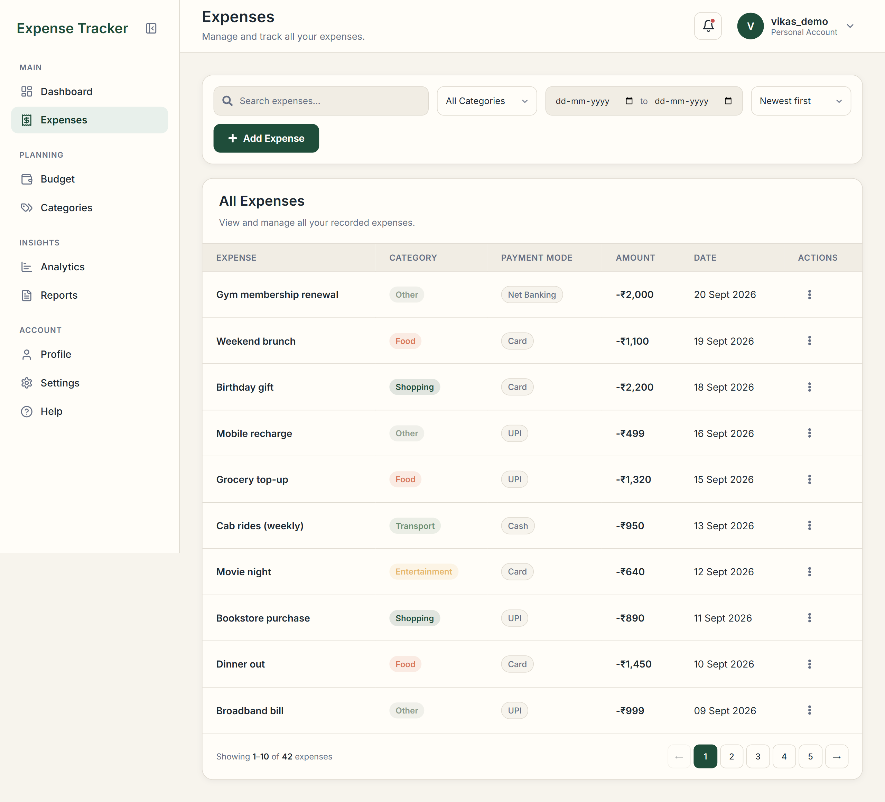
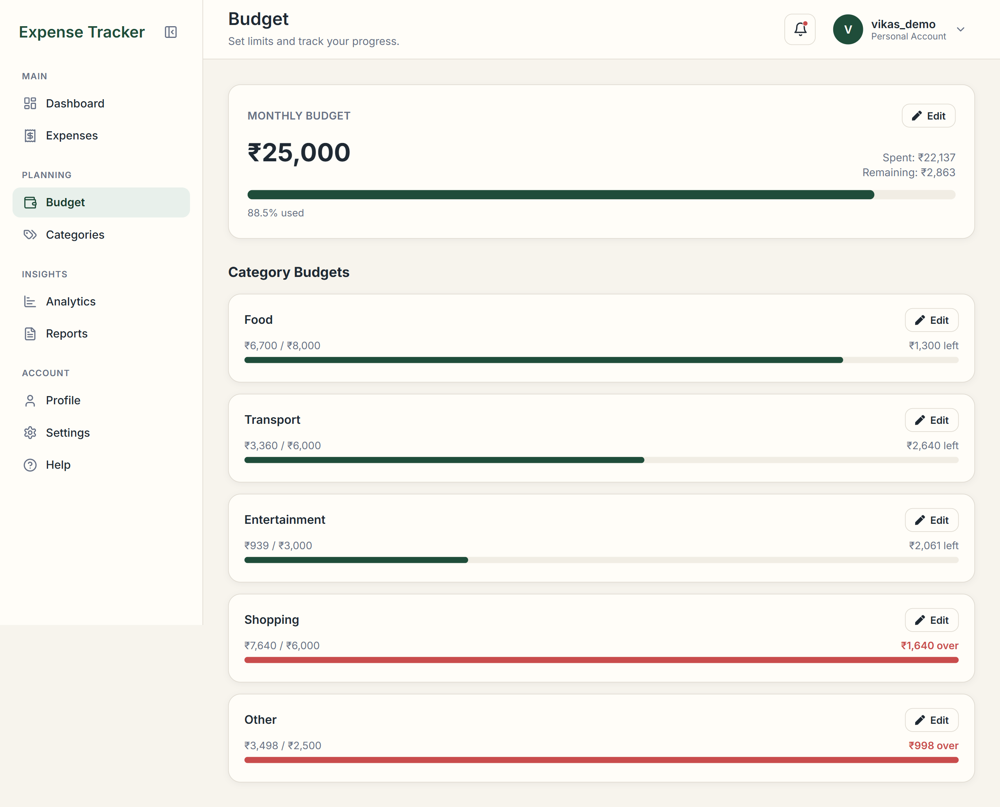
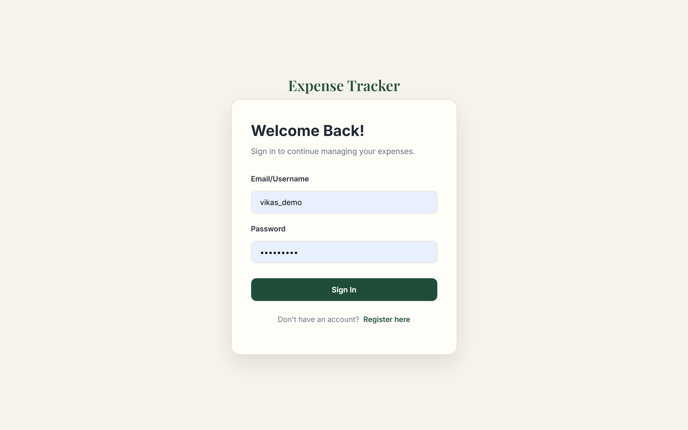
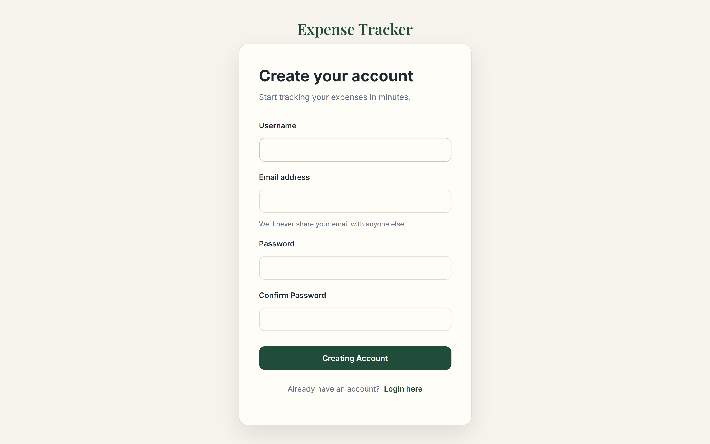

# 💸 Expense Tracker

<p align="center">
  A modern full-stack expense management application built with React, FastAPI, and PostgreSQL.
</p>

<p align="center">
  Securely manage, organize, analyze, and track personal expenses with JWT authentication, protected APIs, budgets, reports, notifications, analytics, and a responsive dashboard.
</p>

<p align="center">


</p>

---

## 🌐 Live Demo

🚀 **Frontend:**
https://expense-tracker-frontend-4n7d.onrender.com

⚙️ **Backend API:**
https://expense-tracker-sdx5.onrender.com

📖 **Swagger API Documentation:**
https://expense-tracker-sdx5.onrender.com/docs

💻 **GitHub Repository:**
https://github.com/vikassagar-creator/expense-tracker

---

# 📌 About The Project

Expense Tracker is a full-stack web application designed to help users manage and understand their personal finances.

Users can create an account, securely authenticate using JWT, manage their expenses, organize spending by category and payment method, create budgets, monitor spending, view analytics, generate reports, and receive budget notifications.

The application uses a React frontend connected to a FastAPI REST API backed by PostgreSQL.

The project demonstrates practical full-stack development including:

- React component architecture
- REST API development
- JWT authentication
- Protected routes
- PostgreSQL database design
- SQLAlchemy ORM
- Alembic migrations
- Pydantic validation
- Expense analytics
- Budget management
- Reporting and exports
- Notification systems
- Responsive UI development
- Git and GitHub workflows
- Cloud deployment with Render

---

# ✨ Features

## 🔐 Authentication & Security

- ✅ User registration
- ✅ User login
- ✅ Password hashing
- ✅ JWT authentication
- ✅ Protected frontend routes
- ✅ Protected backend endpoints
- ✅ User-specific expense data
- ✅ User authorization
- ✅ Token-based API authentication
- ✅ Secure password handling

---

## 💰 Expense Management

- ✅ Add expenses
- ✅ View expenses
- ✅ Edit expenses
- ✅ Delete expenses
- ✅ Expense categories
- ✅ Expense dates
- ✅ Expense amounts
- ✅ Payment modes
- ✅ User-based expense ownership

### Supported Payment Modes

- Cash
- UPI
- Credit Card
- Debit Card
- Other

---

## 🔎 Search, Filtering & Sorting

- ✅ Search expenses by title
- ✅ Filter by category
- ✅ Filter by payment mode
- ✅ Date-based filtering
- ✅ Sort expenses
- ✅ Combine search and filters
- ✅ Reset filters
- ✅ Pagination
- ✅ Dynamic expense table updates

---

# 📊 Dashboard & Analytics

The dashboard provides an overview of the user's spending activity.

- ✅ Total spending
- ✅ Current-month spending
- ✅ Transaction count
- ✅ Top spending category
- ✅ Category spending breakdown
- ✅ Monthly spending trends
- ✅ Spending overview
- ✅ Expense distribution
- ✅ Recent transactions
- ✅ Automatic dashboard updates
- ✅ Empty states for new users

### Visualizations

- Spending trend charts
- Category distribution charts
- Monthly expense analysis
- Recent transaction summaries

---

# 💳 Budget Management

Users can create and manage spending budgets.

- ✅ Create budgets
- ✅ Edit budgets
- ✅ Delete budgets
- ✅ Category-based budgets
- ✅ Budget amount tracking
- ✅ Spending progress
- ✅ Remaining budget calculation
- ✅ Budget status monitoring
- ✅ Budget-related notifications

---

# 📈 Reports

The Reports section provides detailed expense summaries.

- ✅ Monthly reports
- ✅ Expense summaries
- ✅ Category breakdown
- ✅ Payment mode breakdown
- ✅ Monthly spending information
- ✅ CSV export
- ✅ PDF export

Reports are generated through the FastAPI backend and can be downloaded from the application.

---

# 🔔 Notifications

The application includes a notification system for budget-related spending alerts.

- ✅ Budget alerts
- ✅ Category spending notifications
- ✅ Notification dropdown
- ✅ Notification indicator
- ✅ Automatic notification checking
- ✅ Backend notification API

---

# 👤 Profile & Settings

Users can manage their account and application preferences.

- ✅ Profile information
- ✅ Profile updates
- ✅ Account settings
- ✅ Theme settings
- ✅ Dark mode
- ✅ User-specific application experience

---

# 🎨 Frontend

The frontend is built with React and Vite using a component-based architecture.

### Frontend Features

- React
- Vite
- React Router
- JavaScript
- CSS
- Bootstrap
- React Icons
- React Hot Toast
- Responsive layouts
- Protected navigation
- Reusable components
- Modal-based expense forms
- Dynamic dashboard
- Search and filtering
- Responsive expense table
- Sidebar navigation
- Top navigation bar
- Profile dropdown
- Notification dropdown
- Dark mode

---

# ⚙️ Backend

The backend is built using FastAPI and provides the REST API used by the React frontend.

### Backend Features

- FastAPI
- Python
- SQLAlchemy ORM
- PostgreSQL
- Pydantic
- JWT authentication
- Password hashing
- User authorization
- Expense CRUD APIs
- Budget APIs
- Reports APIs
- Notification APIs
- Analytics APIs
- CSV generation
- PDF reporting
- Swagger/OpenAPI documentation
- CORS configuration

---

# 🛠 Tech Stack

| Category | Technology |
|----------|------------|
| Frontend | React, Vite, JavaScript |
| Routing | React Router |
| Styling | CSS, Bootstrap |
| UI Icons | React Icons |
| Notifications | React Hot Toast |
| Backend | FastAPI, Python |
| Database | PostgreSQL |
| ORM | SQLAlchemy |
| Validation | Pydantic |
| Authentication | JWT |
| Password Security | pwdlib / Password Hashing |
| Database Migration | Alembic |
| API | REST API |
| Documentation | Swagger / OpenAPI |
| Version Control | Git + GitHub |
| Deployment | Render |

---

# 🏗️ Application Architecture

```text
                         Expense Tracker
                               |
              ┌────────────────┴────────────────┐
              │                                 │
      React Frontend                     FastAPI Backend
              │                                 │
        React Router                         REST API
              │                                 │
      Protected UI                    JWT Authentication
              │                                 │
       API Client / HTTP                    Pydantic
              │                                 │
              └───────────────┬─────────────────┘
                              │
                         SQLAlchemy
                              │
                              ↓
                         PostgreSQL
                              │
                    ┌─────────┴─────────┐
                    │                   │
                  Users              Expenses
                    │                   │
                    │              Budgets
                    │                   │
                    │              Reports
                    │                   │
                    └──────── Notifications
```

---

# 📂 Project Structure

```text
expense-tracker/
│
├── frontend/
│   ├── src/
│   │   ├── components/
│   │   │   ├── dashboard/
│   │   │   ├── expenses/
│   │   │   └── ...
│   │   │
│   │   ├── pages/
│   │   │   ├── Dashboard.jsx
│   │   │   ├── Expenses.jsx
│   │   │   ├── Analytics.jsx
│   │   │   ├── Budget.jsx
│   │   │   ├── Categories.jsx
│   │   │   ├── Reports.jsx
│   │   │   ├── Settings.jsx
│   │   │   └── Help.jsx
│   │   │
│   │   ├── layouts/
│   │   │   ├── AppLayout.jsx
│   │   │   ├── Sidebar.jsx
│   │   │   └── TopBar.jsx
│   │   │
│   │   ├── hooks/
│   │   ├── services/
│   │   ├── styles/
│   │   ├── App.jsx
│   │   └── main.jsx
│   │
│   └── package.json
│
├── backend/
│   ├── app/
│   │   ├── routers/
│   │   │   ├── users.py
│   │   │   ├── expenses.py
│   │   │   ├── budgets.py
│   │   │   ├── reports.py
│   │   │   └── notifications.py
│   │   │
│   │   ├── models.py
│   │   ├── schemas.py
│   │   ├── database.py
│   │   └── main.py
│   │
│   ├── alembic/
│   ├── alembic.ini
│   └── requirements.txt
│
└── README.md
```

---

# 🚀 Local Setup

## 1. Clone the Repository

```bash
git clone https://github.com/vikassagar-creator/expense-tracker.git
cd expense-tracker
```

## 2. Backend Setup

```bash
cd backend

python -m venv venv
```

Activate the virtual environment

**Windows PowerShell:**

```powershell
.\venv\Scripts\Activate.ps1
```

**Linux / macOS:**

```bash
source venv/bin/activate
```

Install dependencies

```bash
pip install -r requirements.txt
```

Configure environment variables

Create a `.env` file inside `backend/`:

```env
DATABASE_URL=your_postgresql_database_url
SECRET_KEY=your_secret_key
ALGORITHM=HS256
ACCESS_TOKEN_EXPIRE_MINUTES=30
```

Run database migrations

```bash
alembic upgrade head
```

Start the backend

```bash
uvicorn app.main:app --reload
```

Backend will run at:

```text
http://127.0.0.1:8000
```

API documentation:

```text
http://127.0.0.1:8000/docs
```

## 3. Frontend Setup

Open another terminal:

```bash
cd frontend
```

Install dependencies:

```bash
npm install
```

Create a `.env` file inside `frontend/`:

```env
VITE_API_URL=http://127.0.0.1:8000
```

Start the development server:

```bash
npm run dev
```

Frontend will run at:

```text
http://localhost:5173
```

## 4. Run the Application

Make sure both servers are running:

```text
Frontend → http://localhost:5173
Backend  → http://127.0.0.1:8000
API Docs → http://127.0.0.1:8000/docs
```

Open the frontend URL in your browser and register a new account.

---

# 🔒 Authentication Flow

```text
User Registration
        |
        ↓
Password Hashing
        |
        ↓
User Stored in PostgreSQL
        |
        ↓
User Login
        |
        ↓
JWT Token Generated
        |
        ↓
Token Stored in Browser
        |
        ↓
Protected API Requests
        |
        ↓
FastAPI Validates JWT
        |
        ↓
Authenticated User
        |
        ↓
User Can Manage Own Expenses, Budgets & Reports
```

---

# ☁️ Deployment Architecture

```text
                React Frontend
                       |
                       ↓
                    Render
                       |
                       ↓
                FastAPI Backend
                       |
                       ↓
                    Render
                       |
                       ↓
               PostgreSQL Database
```

---

# 📈 Current Project Status

### Core Application

- [x] React frontend
- [x] FastAPI backend
- [x] PostgreSQL integration
- [x] SQLAlchemy ORM
- [x] REST API
- [x] User authentication
- [x] JWT authentication
- [x] Password hashing
- [x] Protected API routes
- [x] User authorization

### Expense Management

- [x] Create expenses
- [x] Read expenses
- [x] Update expenses
- [x] Delete expenses
- [x] Expense categories
- [x] Expense dates
- [x] Payment modes
- [x] Search
- [x] Category filtering
- [x] Payment mode filtering
- [x] Date-range filtering
- [x] Sorting
- [x] Pagination

### Dashboard

- [x] Spending summary
- [x] Monthly spending
- [x] Transaction count
- [x] Top category
- [x] Category analytics
- [x] Monthly spending trend chart
- [x] Expense distribution chart
- [x] Recent transactions
- [x] Empty states for new users

### Budgets

- [x] Create/edit/delete budgets
- [x] Overall + per-category budgets
- [x] Spending progress tracking
- [x] Remaining budget calculation

### Reports

- [x] Monthly reports
- [x] Category & payment mode breakdown
- [x] CSV export
- [x] PDF export

### Notifications

- [x] Budget alerts
- [x] Notification dropdown & indicator

### UI

- [x] Responsive dashboard
- [x] Sidebar navigation
- [x] Dynamic Topbar
- [x] Profile dropdown
- [x] Add/Edit expense modals
- [x] Delete confirmation modal
- [x] Toast notifications
- [x] Search/filter toolbar
- [x] Responsive expense table
- [x] Dark mode
- [x] Shared design-token system (typography, buttons, forms)

### Deployment

- [x] Frontend deployed (Render)
- [x] Backend deployed (Render)
- [x] PostgreSQL database
- [x] Swagger documentation

---

# 🚧 Future Improvements

- [ ] Add automated database migration checks to the deployment pipeline
- [ ] Automated testing (backend + frontend)
- [ ] Docker support
- [ ] Recurring/scheduled expenses
- [ ] Multi-currency support
- [ ] Export budgets/reports to more formats
- [ ] Improved mobile navigation polish

---

# 📸 Screenshots

### Dashboard


### Expense Management


### Budgets


### Authentication



---

# 👨‍💻 Author

## Vikas Sagar

Computer Science & Engineering

GitHub:
https://github.com/vikassagar-creator

---

⭐ If you found this project useful, consider starring the repository!